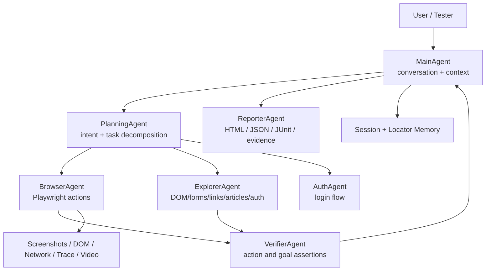

# TestForge

> AI-powered Web QA Agent CLI. Describe what you want to test, and TestForge plans, operates the browser, verifies results, and exports evidence-rich reports.

<p>
  
  
  
  
  
</p>

TestForge 是一个面向软件测试工程师的 AI 自动化 Web 测试框架。它不是传统的录制回放工具，也不是只能执行固定脚本的浏览器封装。你可以像和测试同事沟通一样描述任务：

```text
完整测试 对http://47.242.21.40/这个网站完整测试产出报告
帮我测试一下这个网站的搜索功能，搜索 linux，进入一篇文章并点赞
测试登录功能，账号 admin，密码 ********
如果评论需要登录，就先登录，然后评论一个 666
```

TestForge 会由 MainAgent 理解需求，PlanningAgent 拆解步骤，BrowserAgent 操作页面，ExplorerAgent 读取页面结构，VerifierAgent 判断任务是否真的完成，并在失败时保存截图、DOM、网络请求和 trace 证据。

## Why TestForge

- Natural language first: 用中文或英文描述测试目标，不必先写脚本。
- Multi-agent workflow: 规划、探索、执行、验证、报告分工清晰。
- Playwright powered: 真实浏览器执行，支持点击、填写、导航、截图、trace、video。
- Ref-first locating: 优先使用页面快照里的稳定 ref，再结合语义、文本、placeholder、label 等定位。
- Test-engineering tools: 性能、压力、质量、安全、无障碍、网络/API 摘要、视觉回归、测试数据和报告。
- Plan-explore artifacts: 受 AutoQA-Agent 启发，支持带 URL Scope 的站点深度探索，输出 navigation graph、elements 和 transcript。
- Action IR export: 交互式执行会沉淀动作 IR，可导出为 Playwright Python 测试骨架。
- Local sessions: 会话可保存、加载、回归执行，适合长期测试一个项目。
- Provider flexible: 支持 Claude、OpenAI、Gemini、DeepSeek、Qwen、Kimi、MiniMax 和本地 Ollama。

## Quick Start

### 1. Install

```bash
# Clone or download this repository first, then:
cd TestForge

python -m pip install -r requirements.txt
python -m playwright install chromium
```

### 2. Configure AI

```bash
python run_cli.py
```

选择：

```text
1. 配置 API
```

你可以选择云端模型，也可以选择本地 Ollama：

```text
AI 厂商: local
模型: gemma4:e4b / qwen2.5 / llama3 ...
本地模型服务地址: http://localhost:11434
```

配置会保存到：

```text
~/.testforge/config.json
```

### 3. Enter The CLI

```bash
python run_cli.py
```

选择：

```text
2. 进入 CLI 测试
```

然后直接输入自然语言任务：

```text
(TestForge) > 帮我测试一下http://47.242.21.40/这个网站
(TestForge) > 测试一下登录功能 账号是admin 密码是********
(TestForge) > 完整测试 对http://47.242.21.40/这个网站完整测试产出报告
```

## Example Commands

### Exploratory Testing

```text
帮我测试一下http://example.com这个网站
现在页面有什么功能，可以测试什么？
文章内容有什么，当前页面可以测试什么？
```

### Functional Testing

```text
测试一下登录功能 账号是admin 密码是********
测试搜索功能，搜索 linux，打开第一篇文章
测试评论功能，评论一个 666，如果需要登录就先登录
测试点赞功能，如果点赞需要登录就使用账号密码登录
```

### Full Suite

```text
完整测试 对http://example.com这个网站完整测试产出报告
全量测试 http://example.com
把这个网站全部都测试一遍并生成报告
full suite test https://example.com and generate report
```

The full suite runs:

- site exploration and sitemap
- site-specific test matrix
- known feature smoke testing
- executable functional flows for safe paths such as search, article reading, login verification, and comment prerequisites
- deep checks for discovered sections such as archive, tags, friends, projects, tools, games, photos, travel, resources, RSS, terminal, register, and guestbook
- page quality audit
- basic security audit
- accessibility audit
- performance audit
- low-pressure HTTP load test
- network/API summary
- HTML and JSON reports

### Known Feature Smoke Test

```text
测试当前页面所有已知功能
把页面能看到的功能都测一遍
test all functions
```

This runs the lighter `FeatureTestAgent` path: it uses the current page, sitemap, and session memory to safely open known same-origin feature entries and skips dangerous actions such as logout, delete, payment, upload, and publish.

### Engineering Tools

```text
测试计划
生成测试用例
用例列表
运行用例 login-case
根据需求文档 docs/login.md 生成测试用例
生成缺陷
运行Postman collection.json 环境 env.json
执行SQL select * from users limit 10
导出 Playwright 用例
运行pytest 回归 tests/testforge
生成JMeter脚本 http://example.com 线程10 循环20 状态码200
环境检查 / docker检查 / k8s检查
docker日志 web / k8s日志 pod-name
回归对比 blog-test
站点地图
探索站点 http://example.com 深度2 页面20
探索站点 http://example.com 聚焦 include:/blog* exclude:/admin*
页面质量检查 当前页面
安全检查 当前页面
无障碍检查 当前页面
性能测试 当前页面 3次
压力测试 http://example.com 50次 并发5
网络日志
导出 Playwright 用例
生成报告 html
生成报告 json
保存会话 blog-test
加载会话 blog-test
回归测试 blog-test
```

### QA Workbench

TestForge now includes practical tools that map to common testing engineer work:

- Test case management: generate JSON/Markdown/CSV/XLSX cases, list saved case sets, and replay a named case through the agent.
- Defect drafting: create local bug tickets with steps, actual/expected result, artifacts, API errors, console evidence placeholders, and a copyable summary.
- API testing: import and run a Postman Collection subset, including environment/collection variable substitution, and save an API report.
- Database validation: generate SQL templates and optionally execute MySQL checks after local config.
- Pytest regression: export Playwright-style pytest skeletons from recorded IR and run pytest from the CLI.
- Performance handoff: export JMeter `.jmx` scripts with a response-code assertion, optional CSV data set, and summary listener.
- Environment inspection: run safe Linux/Docker/K8S/Git read-only checks and tail Docker/K8S logs.
- Regression comparison: compare the current session against a saved session, including failures, tested features, visited pages, and performance deltas.

See [docs/COMMANDS.md](docs/COMMANDS.md) for the full command guide.

## Architecture



Core loop:

1. MainAgent receives the user request.
2. PlanningAgent creates a structured plan and assigns logical sub-agent steps.
3. BrowserAgent and ExplorerAgent operate and observe the page.
4. VerifierAgent checks whether the action and the user goal are actually done.
5. If incomplete, MainAgent replans from the current page state.
6. ReporterAgent exports reports and artifacts.

More details: [docs/ARCHITECTURE.md](docs/ARCHITECTURE.md)

## What Gets Saved

TestForge writes local runtime data under:

```text
~/.testforge/
  config.json              # AI and browser configuration
  sessions/                # saved testing sessions
  reports/                 # HTML / JSON / Markdown / JUnit reports
  artifacts/               # failure screenshots, DOM, network, trace
  runs/                    # plan-explore artifacts and interactive IR
  videos/                  # Playwright videos
  visual-baselines/        # visual regression baselines
  locator-memory.json      # successful locator memory
```

Sensitive values such as passwords are redacted before session export.

## Reports And Evidence

Reports can include:

- executed user tasks
- generated test matrix
- tested features
- current URL and page history
- network/API summary
- performance metrics
- load-test metrics
- security and accessibility findings
- failure reason
- artifact paths

On failure, TestForge can save:

- screenshot
- DOM snapshot
- structured page snapshot
- network request log
- Playwright trace
- video recording

Deep exploration writes AutoQA-style artifacts:

```text
~/.testforge/runs/<session>-<runId>/plan-explore/
  navigation-graph.json
  elements.json
  transcript.jsonl
  summary.json
```

## Test Case Import

Markdown test cases are supported from the startup menu or inside the CLI:

```text
运行 specs/login.md
```

Typical use:

```markdown
# Login Smoke Test

- Open {{BASE_URL}}/login
- Fill username with {{USERNAME}}
- Fill password with {{PASSWORD}}
- Click 登录
- Expect 退出
```

Variables such as `{{BASE_URL}}`, `{{USERNAME}}`, and `{{PASSWORD}}` are collected at runtime.

## Safety Model

TestForge is designed for controlled QA work:

- full-suite mode uses low-pressure probing by default
- load tests have request and concurrency caps
- basic security checks are low-risk and browser-visible
- destructive form submission is not performed automatically by the full suite
- credentials are masked in reports and saved sessions

You are still responsible for testing only systems you own or have permission to test.

## Project Layout

```text
TestForge/
  run_cli.py                  # recommended entrypoint
  setup.py                    # legacy launcher / config helper
  src/
    cli/
      main_agent.py           # MainAgent, session state, planning loop
      planning_agent.py       # structured AI planning
      executor_agent.py       # BrowserAgent facade
      verifier_agent.py       # action and goal verification
      tools.py                # Playwright browser/testing tools
      engineering_tools.py    # reports, audits, sessions, evidence helpers
      session_store.py        # local session persistence
      task_state.py           # goal state tracking
    ir/                       # action IR writer for exportable test assets
    runner/                   # IR reader and Playwright test exporter
    ai_client/                # model providers and local Ollama client
    browser/                  # Playwright lifecycle
    parser/                   # Markdown spec parsing and templating
    tools/                    # lower-level automation primitives
  tests/unit/                 # unit tests
  docs/                       # architecture and command docs
```

## Development

Run validation:

```bash
python -m compileall run_cli.py src cli tests examples
python -m pytest tests/unit/ -q
```

Current baseline:

```text
171 passed
```

## Roadmap

See [ROADMAP.md](ROADMAP.md).

Near-term priorities:

- stronger API assertion generation
- richer visual regression reports
- CLI non-interactive mode for CI
- axe-core integration for deeper accessibility checks
- safer login/session replay across regressions
- smarter self-healing locator ranking

## Contributing

Contributions are welcome. Start with [CONTRIBUTING.md](CONTRIBUTING.md).

Good first areas:

- add new browser tools
- improve verifier assertions
- add test-plan generators for more site types
- improve local model prompts and JSON robustness
- add more unit tests around planning and recovery

## License

MIT License. See [LICENSE](LICENSE).
