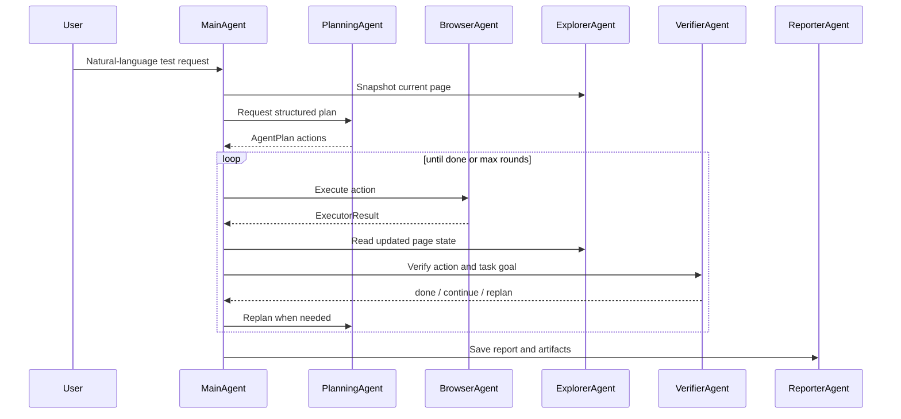

# TestForge Architecture

TestForge is built around an observe-plan-act-verify loop. The goal is to make browser automation behave more like a QA engineer than a fixed script runner.

## Agent Roles

| Agent | Responsibility |
| --- | --- |
| MainAgent | Owns the conversation, context, credentials, task state, sessions, and orchestration. |
| PlanningAgent | Converts natural-language requests into structured actions. |
| ExplorerAgent | Reads page state: links, forms, search results, article content, auth requirements. |
| BrowserAgent | Executes Playwright actions such as navigate, click, fill, scroll, wait, and audits. |
| AuthAgent | Handles login entry discovery, form analysis, credential collection, and submit flow. |
| VerifierAgent | Checks whether an action changed the page and whether the user-level goal is complete. |
| ReporterAgent | Writes HTML, JSON, Markdown, and JUnit-style reports. |
| DataAgent | Generates test data and records created data for later cleanup. |
| SecurityAgent | Performs low-risk checks: headers, mixed content, insecure links and forms. |
| LoadTestAgent | Runs bounded HTTP pressure tests with request and concurrency caps. |
| RegressionAgent | Loads saved sessions and replays previous user tasks. |
| ExploreAgent | Performs bounded URL-scope exploration and writes navigation graph artifacts. |

## Runtime Flow



## Structured Plan

PlanningAgent returns normalized actions instead of prose-only instructions. Typical action types:

- `navigate`
- `click`
- `fill`
- `assert_text`
- `assert_visible`
- `extract_links`
- `extract_search_results`
- `extract_forms`
- `extract_article_content`
- `extract_auth_requirements`
- `performance_audit`
- `load_test`
- `quality_audit`
- `security_audit`
- `accessibility_audit`
- `generate_test_plan`
- `test_login`
- `ask_user`

Interactive actions are also recorded into an AutoQA-style IR stream so successful manual/agent runs can become reusable test assets.

The executor only runs supported actions. Unknown actions fail fast with evidence, which keeps the system debuggable.

## Verification Strategy

TestForge does not treat "clicked something" as success. It verifies at multiple levels:

- action-level: URL changed, DOM changed, text appeared, form disappeared, button state changed
- task-level: search result contains keyword, article page opened, comment appears, like state changed
- auth-level: login error text, token/cookie/localStorage, logout/dashboard indicators, protected-page access
- engineering-level: performance score, load-test error rate, security/a11y issue counts

When verification is inconclusive, MainAgent can replan from the new page state instead of blindly continuing.

## Evidence Model

On important failures, TestForge saves:

- screenshot
- DOM HTML
- structured page snapshot
- network log
- Playwright trace
- video when browser context recording is enabled

Artifacts are stored under:

```text
~/.testforge/artifacts/<session-name>/failure-<timestamp>/
```

Plan exploration artifacts are stored under:

```text
~/.testforge/runs/<session>-<runId>/plan-explore/
  navigation-graph.json
  elements.json
  transcript.jsonl
  summary.json
```

Interactive action IR is stored under the repository working directory:

```text
.testforge/runs/<runId>/ir.jsonl
```

That IR can be exported into Playwright Python test skeletons with `导出 Playwright 用例`.

## Session Model

Sessions preserve:

- current URL and page history
- discovered features
- tested features
- generated test plan
- reports and artifacts
- network summaries
- locator memory
- non-sensitive credentials metadata

Passwords and tokens are not saved in plain text.

## Design Principles

- Stable first: fail with a clear reason and artifacts.
- A11y-first: prefer semantic locators and accessible names.
- Security by default: redact secrets and keep security checks low-risk.
- Learning: remember successful locators and useful page structure.
- Human-in-the-loop: ask the tester for missing credentials, captcha, or destructive-action confirmation.
